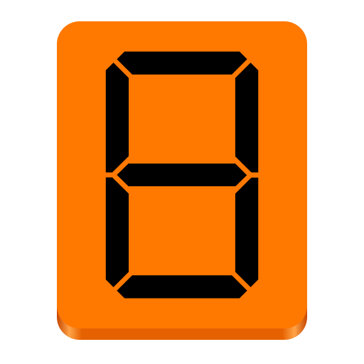
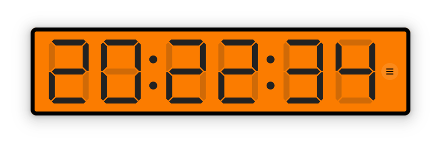
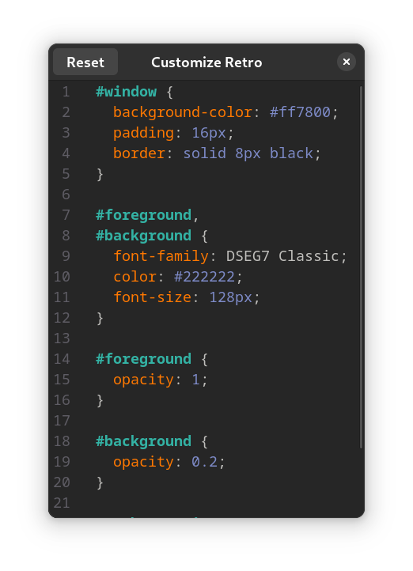
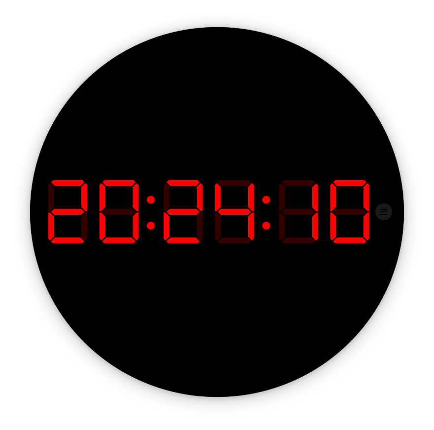

# Retro

A customizable retro digital segment clock

## Development

The simplest solution is to use GNOME Builder.

If you know what you are doing, you can start Retro locally with `make`. Hit `<Control><Shift>Q` to restart Retro.

## Credits

[DSEG font family](https://www.keshikan.net/fonts-e.html) by [Keshikan けしかん](https://twitter.com/keshinomi_88pro/) is licensed under the [SIL Open Font License 1.1](http://scripts.sil.org/OFL).

Made with GJS, GTK 4, GtkSourceView, Flatpak.

Copyright 2022 Sonny Piers.
